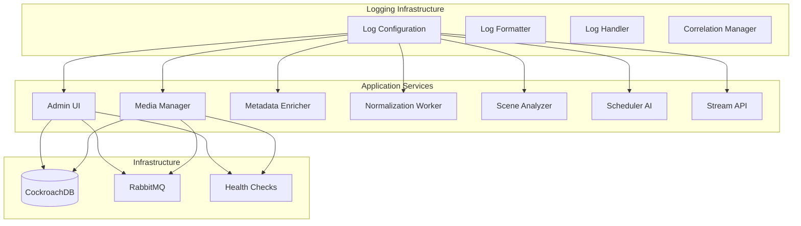

# Design Document

## Overview

Este documento descreve o design técnico para tornar o sistema de TV/mídia pronto para produção, focando em duas áreas críticas:

1. **Correção do Admin UI no Docker**: Resolver problemas de importação de módulos e configuração de contexto
2. **Sistema de Logging Robusto**: Implementar logging estruturado, centralizado e monitorável para todos os serviços

O design visa manter a arquitetura existente enquanto adiciona robustez e observabilidade necessárias para ambiente de produção.

## Architecture

### Current State Analysis

**Admin UI Issues Identified:**
- Dockerfile usa contexto incorreto para importar módulo `shared`
- Falta configuração de variáveis de ambiente para conexão com banco/RabbitMQ
- Ausência de health checks
- Build context não inclui dependências necessárias

**Logging Current State:**
- Logging básico usando `print()` statements em alguns serviços
- Logging inconsistente entre serviços (alguns usam `logging`, outros `print`)
- Sem estruturação JSON para parsing automatizado
- Ausência de correlation IDs para rastreamento entre serviços
- Sem configuração centralizada de níveis de log

### Target Architecture



## Components and Interfaces

### 1. Shared Logging Module

**Location**: `shared/logging_config.py`

**Interface**:
```python
class StructuredLogger:
    def __init__(self, service_name: str, correlation_id: str = None)
    def info(self, message: str, **kwargs)
    def error(self, message: str, error: Exception = None, **kwargs)
    def warning(self, message: str, **kwargs)
    def debug(self, message: str, **kwargs)
    def audit(self, action: str, resource: str, **kwargs)

def get_logger(service_name: str) -> StructuredLogger
def generate_correlation_id() -> str
def configure_logging(level: str = "INFO", format: str = "json")
```

**Features**:
- JSON structured output
- Automatic timestamp and service identification
- Correlation ID propagation
- Configurable log levels via environment variables
- Support for multiple output destinations

### 2. Health Check Module

**Location**: `shared/health_check.py`

**Interface**:
```python
class HealthChecker:
    def __init__(self, service_name: str)
    def add_dependency(self, name: str, check_func: callable)
    def check_health(self) -> dict
    def create_flask_endpoint(self, app: Flask)

def check_database_connection() -> bool
def check_rabbitmq_connection() -> bool
```

### 3. Admin UI Fixes

**Docker Configuration**:
- Fix build context to include `shared` module
- Add proper environment variable configuration
- Include health check endpoint
- Use multi-stage build for optimization

**Application Updates**:
- Integrate structured logging
- Add database connection health checks
- Implement proper error handling with logging
- Add correlation ID tracking for requests

### 4. Configuration Management

**Location**: `shared/config.py`

**Interface**:
```python
class Config:
    @classmethod
    def get_db_config(cls) -> dict
    @classmethod
    def get_rabbitmq_config(cls) -> dict
    @classmethod
    def get_logging_config(cls) -> dict
    @classmethod
    def is_production(cls) -> bool
```

## Data Models

### Log Entry Structure

```json
{
  "timestamp": "2024-11-03T10:30:00.000Z",
  "level": "INFO",
  "service": "admin_ui",
  "correlation_id": "req_123456789",
  "message": "File uploaded successfully",
  "context": {
    "filename": "movie.mp4",
    "file_size": 1024000,
    "user_ip": "192.168.1.100"
  },
  "duration_ms": 150,
  "metadata": {
    "version": "1.0.0",
    "environment": "production"
  }
}
```

### Health Check Response

```json
{
  "status": "healthy",
  "service": "admin_ui",
  "timestamp": "2024-11-03T10:30:00.000Z",
  "checks": {
    "database": {
      "status": "healthy",
      "response_time_ms": 45
    },
    "rabbitmq": {
      "status": "healthy",
      "response_time_ms": 12
    }
  },
  "uptime_seconds": 3600
}
```

## Error Handling

### Error Classification

1. **Critical Errors**: Database connection failures, service startup failures
2. **Operational Errors**: File processing failures, timeout errors
3. **User Errors**: Invalid file uploads, validation failures
4. **System Errors**: Resource exhaustion, configuration errors

### Error Logging Strategy

```python
# Critical Error Example
logger.error(
    "Database connection failed",
    error=exception,
    context={
        "host": db_host,
        "port": db_port,
        "retry_count": retry_count
    },
    severity="critical"
)

# Operational Error Example
logger.warning(
    "File processing timeout",
    context={
        "file_path": file_path,
        "timeout_seconds": timeout,
        "processing_stage": "normalization"
    },
    severity="operational"
)
```

## Testing Strategy

### Unit Tests
- Test logging configuration and formatting
- Test health check functionality
- Test error handling and recovery
- Test correlation ID propagation

### Integration Tests
- Test Admin UI Docker build and startup
- Test logging integration across services
- Test health check endpoints
- Test error scenarios and logging output

### End-to-End Tests
- Test complete request flow with correlation tracking
- Test service failure scenarios and recovery
- Test log aggregation and parsing
- Test monitoring and alerting integration

### Performance Tests
- Test logging performance impact
- Test health check response times
- Test system behavior under load with full logging

## Deployment Considerations

### Environment Variables

```bash
# Logging Configuration
LOG_LEVEL=INFO
LOG_FORMAT=json
LOG_OUTPUT=console
CORRELATION_ID_HEADER=X-Correlation-ID

# Health Check Configuration
HEALTH_CHECK_TIMEOUT=5
HEALTH_CHECK_INTERVAL=30

# Service Configuration
SERVICE_NAME=admin_ui
SERVICE_VERSION=1.0.0
ENVIRONMENT=production
```

### Docker Configuration

- Multi-stage builds for smaller images
- Health checks for all services
- Proper signal handling for graceful shutdown
- Resource limits and monitoring

### Monitoring Integration

- Structured logs compatible with ELK stack, Fluentd, or similar
- Health check endpoints for load balancer integration
- Metrics exposure for Prometheus/Grafana
- Alert rules for critical error patterns